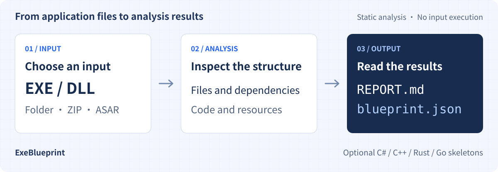

# ExeBlueprint

**Understand the application before you take it over.**

ExeBlueprint turns Windows EXE/DLL files and application packages into a software blueprint: what files are present, which technologies they use, what they depend on, and what code structure can be recovered.
It produces a readable Markdown report alongside structured JSON for scripts or AI tools.

[Download](https://github.com/NickYCLin/exe-blueprint/releases/latest) · [Get started](#get-started) · [Detailed capabilities](docs/capabilities.md) · [Product data for AI](docs/product.json) · [繁體中文](README.md)

[](https://github.com/NickYCLin/exe-blueprint/actions/workflows/ci.yml)
[](https://github.com/NickYCLin/exe-blueprint/releases/latest)
[](LICENSE)

<p><picture>
  <source media="(max-width: 600px)" srcset="docs/images/overview.en.mobile.svg">
  
</picture></p>

The tool runs on **Windows, macOS and Linux**, with a **desktop app and CLI**. Its primary analysis targets are Windows binaries and application packages. It does not execute the input application.

> This page describes the current `main` source. Downloadable packages may not include recent features: check their [release notes](https://github.com/NickYCLin/exe-blueprint/releases), or [run from source](#run-from-source) for the capabilities described here.

## What you can use it for

<table>
  <tr>
    <td width="50%" valign="top"><h3>Take over a legacy application</h3><p>Start with an executable or application folder. Identify its architecture, frameworks, assemblies and resources before planning the work.</p></td>
    <td width="50%" valign="top"><h3>Map dependencies</h3><p>See how EXE and DLL files depend on each other, which dependencies are in the package, and which need to be found elsewhere.</p></td>
  </tr>
  <tr>
    <td valign="top"><h3>Prepare a .NET reconstruction</h3><p>Inspect types, methods and call relationships, then export C# skeletons as a starting point for manual changes.</p></td>
    <td valign="top"><h3>Continue with scripts or AI</h3><p>Use JSON for comparison, classification and inventories while retaining evidence, warnings and incomplete-result flags.</p></td>
  </tr>
</table>

## Inputs and outputs

| Stage | What it includes |
| --- | --- |
| **Input** | An EXE/DLL file, folder, ZIP, Electron ASAR archive, solution or MSBuild project descriptor |
| **Analysis** | File hashes, PE structure, technology detection, dependencies, .NET metadata/IL and embedded resources; optional Ghidra analysis |
| **Read the results** | `REPORT.md`: a Traditional Chinese summary for human review |
| **Process the data** | `blueprint.json`: structured results for programs or AI tools |
| **Optional exports** | C#, C++, Rust and Go code skeletons for reference and manual reconstruction |

Default output structure; `--json-only` omits the Markdown report:

```text
exe-blueprint-output/<input-name>-<timestamp>/
├─ REPORT.md
└─ blueprint.json
```

## Current capabilities

| Area | Available now | Scope and limits |
| --- | --- | --- |
| File and package inventory | PE, SHA-256, imports, assembly references, ZIP/ASAR expansion | Archive size and depth are bounded; outer installer extraction is still planned |
| Large-system overview | Inventory mode, solution/project/component references and file progress | Source support reads declared project structure; it does not evaluate MSBuild or perform source semantic analysis |
| Technology detection | Common .NET, VB6, Delphi, Go, Rust, Python, E-language, Qt and Electron fingerprints | Results include evidence and confidence; detection does not imply source-code recovery |
| .NET structure | Types, fields, properties, events, methods, IL and call graphs | Unsupported or incomplete data is marked |
| Resources and configuration | `.resources`, PNG/GIF header dimensions, WPF BAML structure, embedded JSON/XML configuration structure | Configuration summaries omit values; image pixels are not validated; BAML summaries are not full UI reconstruction |
| C# skeletons | Types, signatures, supported method bodies, `.slnx` and package-local project references | Unrecovered methods retain IL and throw `NotImplementedException`; compilation is not guaranteed |
| C++/Rust/Go skeletons | Type and method signatures | Structural output only; method bodies remain empty |
| Native PE analysis | Optional Ghidra function inventory, static CALL graph and direct tail calls | Indirect targets may be incomplete; conditional/indirect tail calls and native code reconstruction remain planned |

See the [detailed capabilities and roadmap](docs/capabilities.md) and [architecture](docs/architecture.md) for the full scope and data contracts. These detailed documents are in Traditional Chinese.

## Get started

### Desktop app

1. Download your platform's package from [Releases](https://github.com/NickYCLin/exe-blueprint/releases/latest), verify it against `SHA256SUMS.txt`, and install or extract it.
2. Select or drop an input and confirm the output folder. Keep the defaults for a first analysis; additional languages and Ghidra are under advanced options.
3. Progress, result counts and warnings appear on the right. Open the report or output folder from there. See the [desktop guide](docs/desktop-guide.md) for the current main interface; downloadable versions follow their release notes.

Starting with v0.3.0, releases include a [Windows installer](docs/windows-installer.md) and [macOS DMG](docs/macos-dmg.md). Portable ZIP packages remain available.

| Host platform | Package name ends with | Launch |
| --- | --- | --- |
| Windows 10/11 x64 | `win-x64-setup.exe` or `win-x64.zip` | Use the Start menu after installation, or run `ExeBlueprint.exe` |
| macOS Apple Silicon | `macos-arm64.dmg` or `macos-arm64.zip` | Copy `ExeBlueprint.app` to Applications, then open it |
| macOS Intel | `macos-x64.dmg` or `macos-x64.zip` | Copy `ExeBlueprint.app` to Applications, then open it |
| Linux x64 | `linux-x64.tar.gz` | `ExeBlueprint` |

Packages include the .NET runtime and an `exe-blueprint-cli` command-line version. The packaged `README.txt` explains first launch and Linux dependencies. Windows/macOS builds are unsigned; macOS builds are not notarized.

### Run from source

Install the [.NET 10 SDK](https://dotnet.microsoft.com/download/dotnet/10.0). From the repository root:

```powershell
# Open the desktop app
dotnet run --project ./src/ExeBlueprint.Desktop

# Analyze a folder and write JSON plus a report
dotnet run --project ./src/ExeBlueprint.Cli -- analyze ./MyApplication -o ./report

# EXE, DLL, ZIP and ASAR inputs are also accepted
dotnet run --project ./src/ExeBlueprint.Cli -- analyze ./MyApplication.zip -o ./zip-report
```

Optional exports:

```powershell
# C# skeletons; --emit-cpp, --emit-rust and --emit-go can be combined
dotnet run --project ./src/ExeBlueprint.Cli -- analyze ./App.dll --emit-csharp

# JSON only
dotnet run --project ./src/ExeBlueprint.Cli -- analyze ./App.dll --json-only

# Native PE analysis using an existing Ghidra installation
dotnet run --project ./src/ExeBlueprint.Cli -- analyze ./Native.exe --native --ghidra ./ghidra
```

If Ghidra is missing, other analysis continues and the native result records why it was skipped. The exporter uses Jython; Ghidra 12.1.3 requires its bundled Jython extension. See [native acceptance](docs/native-acceptance.md) for setup and tested scope. Existing reports are preserved unless `--force` is supplied. Run `dotnet run --project ./src/ExeBlueprint.Cli -- --help` for all options.

## For AI and automation

**To understand this product**, read [docs/product.json](docs/product.json): it lists positioning, inputs, outputs, feature status, limitations and source references. This product profile is separate from an analysis result's `blueprint.json`.

For large source folders, use `--source --inventory`; for compiled application folders, use `--inventory`. The overview keeps project and assembly references while skipping IL, embedded resource contents and Ghidra. See [large-project analysis](docs/large-project-analysis.md) for scope and reproducible scale checks.

**To read an analysis result**, start with `schemaVersion`, `analysisMode`, `summary` and `warnings`, then inspect `projectGraph`, `files`, `dependencies`, `technologies` and `archives`. The current `main` output schema is `0.21`.

- Read technology detections together with their `evidence` and `confidence`.
- Truncation flags, `complete=false` and error fields indicate missing information. Missing data is not evidence of absence; see the [architecture](docs/architecture.md) for field definitions.
- `nativeCode.callGraph=null` means a graph was not supplied; `targetAddress=null` means that call's target was unresolved.
- ExeBlueprint exports files that external AI tools can read. It has no built-in AI model and does not automatically rewrite an entire application.

## Development and contributions

See [CONTRIBUTING.md](CONTRIBUTING.md) for builds and tests, and the [release guide](docs/releasing.md) for packaging.
Use concise Traditional Chinese Conventional Commits and pull/integrate remote changes before pushing.

Analyze only software you own or are authorized to inspect. Reports can still contain program strings and embedded resource content: review them before sharing with other people or external AI services. Keep customer binaries, reconstructed proprietary code, credentials and internal configuration out of the repository. See [SECURITY.md](SECURITY.md) for security reporting.

Licensed under the [MIT License](LICENSE). The bundled Noto Sans TC fonts use the SIL Open Font License; see [font sources and license](src/ExeBlueprint.Desktop/Assets/Fonts/README.md).
