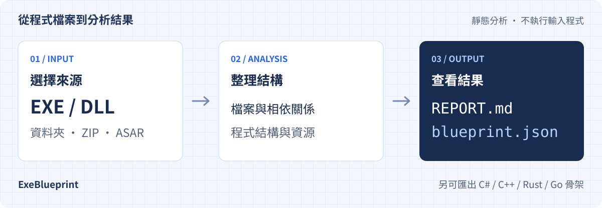

# ExeBlueprint

**先看懂程式，再決定怎麼接手。**

ExeBlueprint 把 Windows EXE、DLL 與應用程式套件整理成程式藍圖：有哪些檔案、用了什麼技術、依賴哪些組件，以及能讀出多少程式結構。
分析結果同時提供可直接閱讀的 Markdown 報告，以及供腳本或 AI 處理的 JSON。

[下載桌面版](https://github.com/NickYCLin/exe-blueprint/releases/latest) · [開始使用](#開始使用) · [功能詳解](docs/capabilities.md) · [給 AI 的產品資料](docs/product.json) · [English](README.en.md)

[](https://github.com/NickYCLin/exe-blueprint/actions/workflows/ci.yml)
[](https://github.com/NickYCLin/exe-blueprint/releases/latest)
[](LICENSE)

<p><picture>
  <source media="(max-width: 600px)" srcset="docs/images/overview.zh-TW.mobile.svg">
  
</picture></p>

工具可在 **Windows、macOS、Linux** 執行，提供**桌面版與 CLI**。主要分析對象是 Windows 程式與應用程式套件；分析時不會執行輸入程式。

> 本頁介紹目前 `main` 原始碼的能力。下載套件可能尚未包含最近的功能，請查看對應的 [Release 說明](https://github.com/NickYCLin/exe-blueprint/releases)；要使用 `main` 的功能，可[從原始碼執行](#從原始碼執行)。

## 適合拿來做什麼

<table>
  <tr>
    <td width="50%" valign="top"><h3>接手舊系統</h3><p>只剩執行檔或一包安裝目錄時，先確認程式架構、框架、組件與資源，再規劃後續工作。</p></td>
    <td width="50%" valign="top"><h3>盤點相依套件</h3><p>查看 EXE／DLL 之間的依賴，分清哪些組件在套件內、哪些需要另外尋找。</p></td>
  </tr>
  <tr>
    <td valign="top"><h3>準備 .NET 重建</h3><p>整理型別、方法與呼叫關係，匯出 C# 骨架，從已知結構開始接手改寫。</p></td>
    <td valign="top"><h3>交給腳本或 AI 接著分析</h3><p>用 JSON 做比對、分類或整理清單，保留判斷依據、警告與不完整狀態。</p></td>
  </tr>
</table>

## 放進什麼，會拿到什麼

| 階段 | 內容 |
| --- | --- |
| **輸入** | 單一 EXE／DLL、資料夾、ZIP、Electron ASAR |
| **分析** | 檔案雜湊、PE 結構、技術辨識、相依關係、.NET metadata／IL 與內嵌資源；可選配 Ghidra 原生分析 |
| **閱讀結果** | `REPORT.md`：繁體中文摘要，方便先看重點 |
| **處理資料** | `blueprint.json`：結構化結果，方便程式或 AI 讀取 |
| **選擇性輸出** | C#、C++、Rust、Go 程式骨架，供對照與改寫 |

預設輸出如下；加上 `--json-only` 時只產生 JSON。

```text
exe-blueprint-output/<輸入名稱>-<時間>/
├─ REPORT.md
└─ blueprint.json
```

## 目前做到哪裡

| 項目 | 已有能力 | 使用時要知道 |
| --- | --- | --- |
| 檔案與套件盤點 | PE、SHA-256、imports、assembly references、ZIP／ASAR 展開 | 封存有大小與深度上限；尚未解開各類外層安裝器 |
| 技術辨識 | 辨識 .NET、VB6、Delphi、Go、Rust、Python、易語言、Qt、Electron 等常見特徵 | 結果附依據與可信度，辨識到語言不等於能還原該語言原始碼 |
| .NET 結構分析 | 型別、欄位、屬性、事件、方法、IL、呼叫圖 | 遇到不支援或不完整的資料會保留註記 |
| 資源與設定 | `.resources`、PNG／GIF 檔頭尺寸、WPF BAML 結構、內嵌 JSON／XML 設定結構 | 設定摘要省略值；圖片只讀檔頭，BAML 結構摘要不等於完整還原 UI |
| C# 骨架 | 型別與簽章、可還原的方法體、`.slnx` 和套件內專案參照 | 未還原方法保留 IL 並使用 `NotImplementedException`；不保證直接編譯 |
| C++／Rust／Go 骨架 | 型別與方法簽章 | 目前以結構為主，方法體留空 |
| 原生 PE 分析 | 選配 Ghidra，列出函式、靜態 CALL 及直接 tail call | 間接目標可能不完整；條件／間接 tail call 與原生程式碼還原仍待完成 |

完整支援清單與待辦見[功能詳解](docs/capabilities.md)，資料欄位與解析規則見[架構說明](docs/architecture.md)。

## 開始使用

### 桌面版

1. 到 [Releases](https://github.com/NickYCLin/exe-blueprint/releases/latest) 下載對應平台的套件，依 `SHA256SUMS.txt` 核對後安裝或解壓縮。
2. 選擇或拖入分析來源，確認儲存位置。第一次使用可保留預設選項；其他語言與 Ghidra 設定在進階選項。
3. 開始分析後，右側會顯示進度、結果摘要與注意事項，再按「閱讀報告」或「開啟結果資料夾」。新版操作流程見[桌面版說明](docs/desktop-guide.md)，下載版請以該版本說明為準。

v0.3.0 起提供 [Windows 安裝程式](docs/windows-installer.md)與 [macOS DMG](docs/macos-dmg.md)，ZIP 免安裝版仍保留。

| 執行環境 | 下載套件名稱結尾 | 啟動檔 |
| --- | --- | --- |
| Windows 10／11 x64 | `win-x64-setup.exe` 或 `win-x64.zip` | 安裝後從開始功能表開啟，或執行 `ExeBlueprint.exe` |
| macOS Apple Silicon | `macos-arm64.dmg` 或 `macos-arm64.zip` | 將 `ExeBlueprint.app` 放入「應用程式」後開啟 |
| macOS Intel | `macos-x64.dmg` 或 `macos-x64.zip` | 將 `ExeBlueprint.app` 放入「應用程式」後開啟 |
| Linux x64 | `linux-x64.tar.gz` | `ExeBlueprint` |

下載套件已包含 .NET runtime，也附有 `exe-blueprint-cli` 命令列版本。首次開啟與 Linux 相依套件的說明在壓縮檔內的 `README.txt`；目前 Windows／macOS 產物未做商業程式碼簽章，macOS 未經公證。

### 從原始碼執行

需要 [.NET 10 SDK](https://dotnet.microsoft.com/download/dotnet/10.0)。在 repository 根目錄執行：

```powershell
# 開啟桌面版
dotnet run --project ./src/ExeBlueprint.Desktop

# 分析資料夾，輸出 JSON 與報告
dotnet run --project ./src/ExeBlueprint.Cli -- analyze ./MyApplication -o ./report

# 也可直接分析 EXE、DLL、ZIP 或 ASAR
dotnet run --project ./src/ExeBlueprint.Cli -- analyze ./MyApplication.zip -o ./zip-report
```

常用的選擇性輸出：

```powershell
# 產生 C# 骨架；也可搭配 --emit-cpp、--emit-rust、--emit-go
dotnet run --project ./src/ExeBlueprint.Cli -- analyze ./App.dll --emit-csharp

# 僅輸出 JSON
dotnet run --project ./src/ExeBlueprint.Cli -- analyze ./App.dll --json-only

# 使用已安裝的 Ghidra 分析原生 PE
dotnet run --project ./src/ExeBlueprint.Cli -- analyze ./Native.exe --native --ghidra ./ghidra
```

找不到 Ghidra 時，其他分析仍會繼續，原生分析會附上略過原因。匯出腳本使用 Jython；Ghidra 12.1.3 需先安裝隨附的 Jython 擴充，步驟與實測範圍見[原生分析驗收](docs/native-acceptance.md)。輸出目錄已有報告時預設不覆寫；需要覆寫時加上 `--force`。完整參數可用 `dotnet run --project ./src/ExeBlueprint.Cli -- --help` 查看。

## 給 AI 或自動化工具

**了解這個產品**：讀取 [docs/product.json](docs/product.json)，其中列出定位、輸入、輸出、功能狀態、限制及原始碼依據。這是產品說明資料，與實際分析產生的 `blueprint.json` 分開。

**閱讀一次分析結果**：先看 `schemaVersion`、`summary` 與 `warnings`，再依需求讀取 `files`、`dependencies`、`technologies` 和 `archives`。目前 `main` 輸出的 schema 是 `0.19`。

- 技術判斷要連同 `evidence` 與 `confidence` 閱讀。
- `truncated`、`complete=false` 或錯誤欄位代表資料有缺口，不能把缺少的資料解讀成「不存在」。各層欄位定義見[架構說明](docs/architecture.md)。
- `nativeCode.callGraph=null` 表示未提供呼叫圖；`targetAddress=null` 表示該筆呼叫目標未解析。
- ExeBlueprint 產生可供 AI 讀取的檔案，目前未內建 AI 模型，也不會自動完成整套系統重寫。

## 開發與參與

建置與測試方式見 [CONTRIBUTING.md](CONTRIBUTING.md)，發佈方式見[發佈指南](docs/releasing.md)。
Commit 使用自然、簡潔的繁體中文 `<type>(<scope>): <主旨>`；push 前先 pull 並整合遠端改動。

只分析自己擁有或已獲授權的程式。分析報告仍可能包含程式字串與內嵌資源內容，分享給他人或外部 AI 前請先檢查；不要將客戶程式、反編譯結果、帳密或內部設定提交到 repository。安全問題的回報方式見 [SECURITY.md](SECURITY.md)。

本專案採用 [MIT License](LICENSE)。桌面版隨附的 Noto Sans TC 字型採用 SIL Open Font License，詳見[字型來源與授權](src/ExeBlueprint.Desktop/Assets/Fonts/README.md)。
