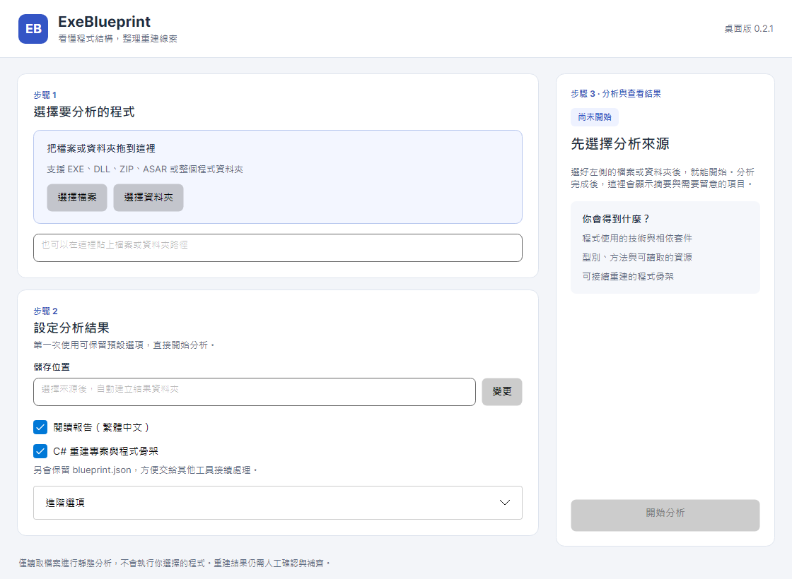

# 桌面版操作

目前 main 的介面分成三個步驟。設定在左側，分析進度和結果固定顯示在右側；縮小視窗時，設定與結果內容各自捲動，主要按鈕仍可操作。

## 第一次分析

1. 在「選擇要分析的程式」選檔案或資料夾，也可以直接拖曳，或貼上路徑。
2. 確認儲存位置。預設放在使用者文件目錄下的 `exe-blueprint-output`，以來源名稱與時間分開；沒有文件目錄的環境會使用使用者家目錄。自行變更位置後，切換來源不會改掉這項設定。
3. 按「開始分析」。預設會產生繁體中文報告、JSON，以及可產生的 C# 重建專案。其他語言、Ghidra 與覆寫設定在「進階選項」。

程式只做靜態分析，不會執行選取的程式。產生的骨架仍可能需要人工補齊，不能把它視為完整還原的原始碼。

## 查看結果

分析完成後，右側列出檔案、型別、方法與注意事項數量。注意事項會直接顯示內容；超過 100 項時，完整清單可在 `blueprint.json` 的 `warnings` 欄位查看。

「閱讀報告」會用系統預設程式開啟 `REPORT.md`。若沒有設定 Markdown 開啟程式，可用「開啟結果資料夾」，再以文字編輯器閱讀。沒有勾選閱讀報告時，只提供資料夾入口。

切換分析來源後會清除上一份畫面的結果，避免混淆。「最近分析過的來源」只會在已有成功紀錄時出現。

## 重新分析與取消

保留預設儲存位置時，再次分析會建立新的結果資料夾。自行指定位置時，預設不覆寫已有結果；可變更位置，或在進階選項明確勾選覆寫。

分析中可以取消。取消或失敗後會顯示原因，原本的設定仍會保留，方便修改後重試；已產生的部分檔案可能仍留在儲存位置。

## 介面驗證

桌面測試以 Avalonia Headless 搭配 Skia 載入實際 XAML，涵蓋預設與自訂位置、實際分析產出、覆寫保護、取消、舊進度回報、結果切換、JSON-only、鍵盤操作、150% 縮放，以及 1120 × 820／820 × 640 視窗。

可設定 `EXEBLUEPRINT_UI_SCREENSHOTS` 後執行桌面測試，輸出初始、進階、分析中、取消、失敗與完成畫面的 PNG。這是介面渲染與操作驗證，系統檔案選擇器及預設 Markdown 程式仍由各作業系統提供。
